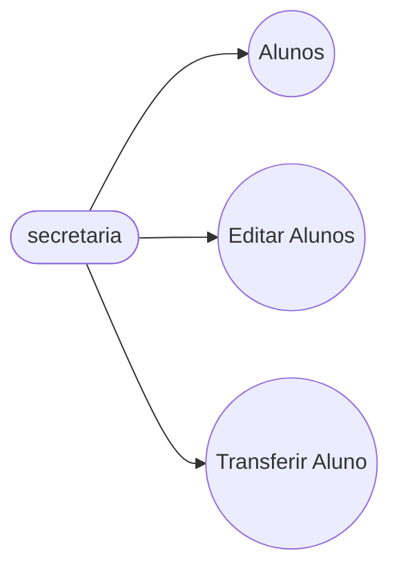
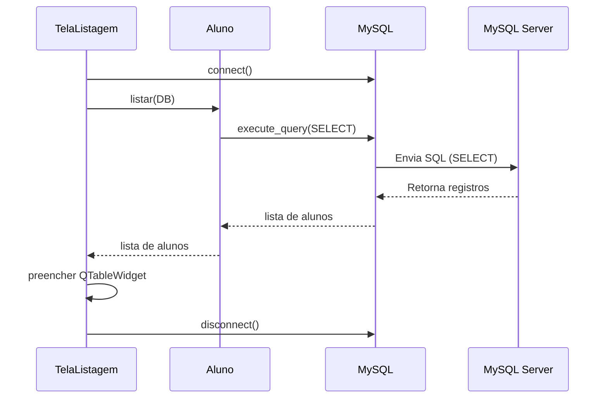

# Projeto Universidade

Modelagem em Orientaçao à Objetos das Entidades Alunos, Cursos e Turmas.

# Casos de Uso


## Diagrama de classes
```mermaid
## Diagrama de Sequência - **Cadastro**


## Diagrama de Sequência - **Listagem**
```mermaid
sequenceDiagram
    participant UI as TelaListagem
    participant Entidade as Aluno
    participant DB as MySQL
    participant Banco as MySQL Server

    UI ->> DB: connect()
    UI ->> Entidade: listar(DB)
    Entidade ->> DB: execute_query(SELECT)
    DB ->> Banco: Envia SQL (SELECT)
    Banco -->> DB: Retorna registros
    DB -->> Entidade: lista de alunos
    Entidade -->> UI: lista de alunos
    UI ->> UI: preencher QTableWidget
    UI ->> DB: disconnect()
```
## Diagrama de Sequência - **Listagem**

 **Dependencias:**

- **VSCode**: IDE(Interface de Desenvolvimento)

- **Mermaid**: Linguagem para confecçao de Diagramas em documentos MD (Mark Down)

- **Material Icon Theme**: Tema para as pastas.

- **Git Lens**: Interface grafica pra o 
versionamento .git integrada ao VSCode.

# conceitos Mysql

## Build 

**Dependencias:**

pip install pyinstaller
```
**Congelar Depedencias:**

pip install -r requirements.txt
```
pip freeze > requirements.txt
```

**Diretorio Raiz do Projeto Pasta:**
Python
```
cd python
```
```
pyinstaller --onefile --windowed app.py
```

**O executavel estara em:** dist/app.exe
