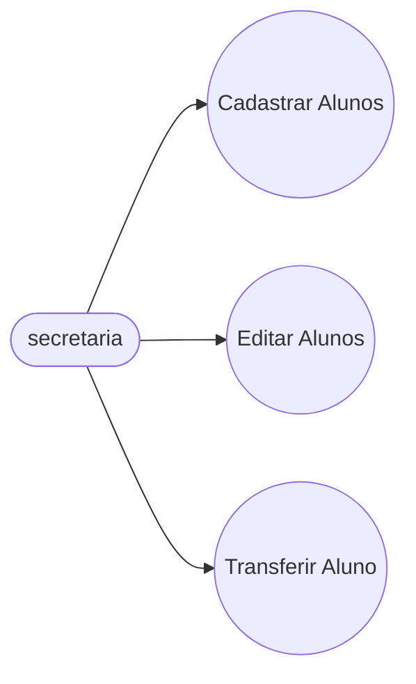
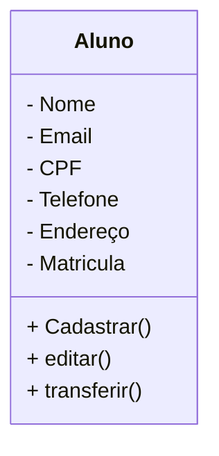

# Projeto Universidade

Modelagem em Orientaçao à Objetos das Entidades Alunos, Cursos e Turmas.

# Casos de Uso

## Diagrama de classes

## Dependencias
- **VSCode**: IDE(Interface de Desenvolvimento)

- **Mermaid**: Linguagem para confecçao de Diagramas em documentos MD (Mark Down)

- **Material Icon Theme**: Tema para as pastas.

- **Git Lens**: Interface grafica pra o 
versionamento .git integrada ao VSCode.